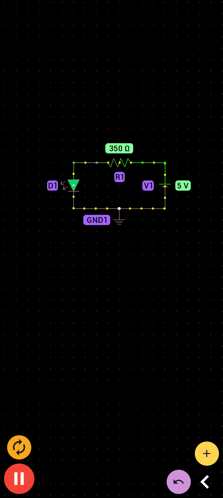
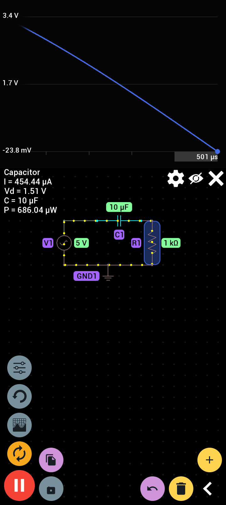

# Hands-On Electronics & Digital Logic Labs ⚡

A collection of foundational digital logic gates and analog timing circuits built using **Logic Circuit Simulator Pro**, **PROTO**, and verified with **Electrodoc**.

---

## 🛠️ Tools Used
* **Logic Circuit Simulator Pro:** Digital logic gate construction and truth table verification.
* **PROTO:** Interactive SPICE circuit simulation for analog/mixed-signal circuits.
* **Electrodoc:** Component calculations (Resistor Color Codes, LED Series Resistors).

---

## 1. Component Calculations (Electrodoc)
* **$1\text{ k}\Omega$ Resistor Code:** Verified **Brown – Black – Red – Gold** ($\pm 5\%$).
* **LED Current Limiting:** Calculated $R = 350\ \Omega$ for a $9\text{V}$ source, $2\text{V}$ LED forward drop ($V_f$), and $20\text{mA}$ forward current ($I_f$).

$$R = \frac{V_{CC} - V_f}{I_f} = \frac{9\text{V} - 2\text{V}}{0.020\text{A}} = 350\ \Omega$$

---

## 2. Universal Logic Implementation (Logic Circuit Simulator Pro)
Built fundamental logic functions using **only 2-input NAND gates**:

### A. NOT Gate (Inverter)
* **Configuration:** 1 NAND gate with inputs tied together.

### B. AND Gate
* **Configuration:** 2 NAND gates (NAND 1 feeds into an inverter stage).

### C. OR Gate
* **Configuration:** 3 NAND gates using De Morgan's Law ($A + B = \overline{\overline{A} \cdot \overline{B}}$).

---

## 3. Astable 555 Timer Flasher (PROTO)
An analog oscillator circuit generating a continuous square wave output to pulse an LED indicator.

### Circuit Specifications
* **Supply Voltage ($V_{CC}$):** $9\text{ V}$
* **Timing Resistors:** $R_1 = 1\text{ k}\Omega$, $R_2 = 10\text{ k}\Omega$
* **Timing Capacitor:** $C = 10\mu\text{F}$
* **Output Frequency:** $\approx 6.8\text{ Hz}$

---

## 📁 Repository Structure

## 2. Universal Logic Implementation (Logic Circuit Simulator Pro)

The standard NAND gate (the universal gate) was used as the single building block to construct the three fundamental logic functions.

### A. NAND Gate Base Case
Verified the operation of a single 2-input NAND gate.
* **Output:** LOW only when both inputs are HIGH.

### B. AND Gate Construction
Constructed an AND gate using two 2-input NAND gates. The first NAND gate performs the standard NAND function, and its output is fed into a second NAND gate configured as an inverter (both inputs tied together).
* **Configuration:** $A \cdot B = \overline{\overline{A \cdot B}}$
* **Output:** HIGH only when both inputs are HIGH.

### C. OR Gate Construction
Constructed an OR gate using three 2-input NAND gates. Applying De Morgan's Law, the two inputs are first inverted using NAND gates, and those inverted outputs are fed into a third NAND gate.
* **Configuration:** $A + B = \overline{\overline{A} \cdot \overline{B}}$
* **Output:** HIGH when at least one input is HIGH.

---

## 3. Day 02: Exclusive-OR (XOR) Gate Implementation

Constructed an XOR gate using 4 universal NAND gates to perform exclusive addition ($A \oplus B$).

### A. 4-NAND XOR Gate Construction
* **Boolean Expression:** $Y = A \oplus B = A\overline{B} + \overline{A}B = \overline{\overline{A \cdot \overline{A \cdot B}} \cdot \overline{B \cdot \overline{A \cdot B}}}$
* **Truth Table Verification:**
  * $A=0, B=0 \implies \text{Output } 0$ (OFF)
  * $A=0, B=1 \implies \text{Output } 1$ (ON)
  * $A=1, B=0 \implies \text{Output } 1$ (ON)
  * $A=1, B=1 \implies \text{Output } 0$ (OFF)

### B. Resistor Color Code & LED Current Limiting (Electrodoc)

Calculated theoretical resistor values for physical component identification and LED protection.

#### 1. Resistor Color Code Identification
* **Bands:** Brown (1), Black (0), Red ($\times 100$), Gold ($\pm 5\%$)
* **Decoded Value:** $1\text{ k}\Omega \pm 5\%$ ($950\,\Omega \text{ to } 1050\,\Omega$)

#### 2. LED Series Resistor Calculation
* **Parameters:** Supply Voltage ($V_S$) = $9\text{ V}$, Forward Voltage ($V_F$) = $2\text{ V}$, Forward Current ($I_F$) = $20\text{ mA}$
* **Calculation:** $R = \frac{V_S - V_F}{I_F} = \frac{9\text{ V} - 2\text{ V}}{0.02\text{ A}} = 350\,\Omega$
* **Power Dissipation:** Resistor $P(R) = 140\text{ mW}$, LED $P(\text{LED}) = 40\text{ mW}$

# Day 03: Basics of Circuit Simulation

## 1. Proto Simulation
- **Observations:** Current dots flowing clockwise. LED lit up without overcurrent.
  

## Day 04:AC Circuits, and Universal Gates

### 1. Proto Simulation (AC Circuit & RC Filter)

### 2. Logic Circuit Simulator Pro (NAND Gate as Inverter)

- **Input 0 $\rightarrow$ Output 1 (Bulb ON):**
  

- **Input 1 $\rightarrow$ Output 0 (Bulb OFF):**
  
