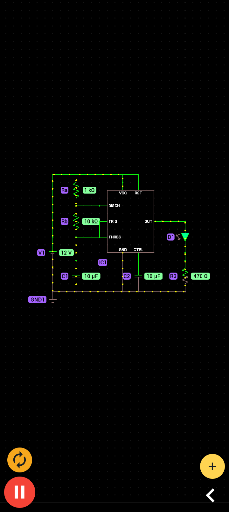

# Hands-On Electronics & Digital Logic Labs ⚡

A collection of foundational digital logic gates and analog timing circuits built using **Logic Circuit Simulator Pro**, **PROTO**, and verified with **Electrodoc**.

---

## 🛠️ Tools Used
* **Logic Circuit Simulator Pro:** Digital logic gate construction and truth table verification.
* **PROTO:** Interactive SPICE circuit simulation for analog/mixed-signal circuits.
* **Electrodoc:** Component calculations (Resistor Color Codes, LED Series Resistors).

---

## 1. Component Calculations (Electrodoc)
* **$1\text{ k}\Omega$ Resistor Code:** Verified **Brown – Black – Red – Gold** ($\pm 5\%$).
* **LED Current Limiting:** Calculated $R = 350\ \Omega$ for a $9\text{V}$ source, $2\text{V}$ LED forward drop ($V_f$), and $20\text{mA}$ forward current ($I_f$).

$$R = \frac{V_{CC} - V_f}{I_f} = \frac{9\text{V} - 2\text{V}}{0.020\text{A}} = 350\ \Omega$$

---

## 2. Universal Logic Implementation (Logic Circuit Simulator Pro)
Built fundamental logic functions using **only 2-input NAND gates**:

### A. NOT Gate (Inverter)
* **Configuration:** 1 NAND gate with inputs tied together.

### B. AND Gate
* **Configuration:** 2 NAND gates (NAND 1 feeds into an inverter stage).

### C. OR Gate
* **Configuration:** 3 NAND gates using De Morgan's Law ($A + B = \overline{\overline{A} \cdot \overline{B}}$).

---

## 3. Astable 555 Timer Flasher (PROTO)
An analog oscillator circuit generating a continuous square wave output to pulse an LED indicator.

### Circuit Specifications
* **Supply Voltage ($V_{CC}$):** $9\text{ V}$
* **Timing Resistors:** $R_1 = 1\text{ k}\Omega$, $R_2 = 10\text{ k}\Omega$
* **Timing Capacitor:** $C = 10\mu\text{F}$
* **Output Frequency:** $\approx 6.8\text{ Hz}$

---

## 📁 Repository Structure

